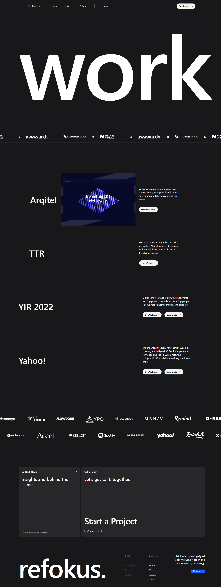

# Refokush

A React single-page website built with Vite, Tailwind CSS, Motion, Locomotive Scroll, and React Icons.



## Technologies Used

- React 19
- Vite
- Tailwind CSS 4
- Motion for animations
- Locomotive Scroll for smooth scrolling
- React Icons
- Oxlint

## Getting Started

Install the dependencies:

```bash
npm install
```

Start the development server:

```bash
npm run dev
```

## Available Scripts

- `npm run dev` - start the development server
- `npm run build` - create a production build
- `npm run lint` - run Oxlint
- `npm run preview` - preview the production build
